# Slinky Metrics

This document describes the various instrumentation points that are available in the side-car. This should be utilized to monitor the health of Slinky and the services it is proxying.

If there are any additional metrics that you would like to see, please open an issue in the [GitHub repository](https://github.com/skip-mev/slinky). Note that this document is not fully comprehensive and may be updated in the future. However, it should provide a good starting point for monitoring Slinky.

# Table of Contents

* [Metrics](#metrics)
    * [Health Metrics](#health-metrics)
    * [Prices Metrics](#prices-metrics)
        * [Price Feed Metrics](#price-feed-metrics)
        * [Aggregated Price Metrics](#aggregated-price-metrics)
    * [HTTP Metrics](#http-metrics)
    * [WebSocket Metrics](#websocket-metrics)

# Metrics

> **Definitions**:
>
> * **Market**: A market is a pair of assets that are traded against each other. For example, the BTC-USD market is the market where Bitcoin is traded against the US Dollar.
> * **Price Feed**: A price feed is indexed by a price provider and a market. For example, the Coinbase API provides a price feed for the BTC-USD market.
> * **Price Provider**: A price provider is a service that provides price data for a given market. For example, the Coinbase API is a price provider for the Coinbase markets.
> * **Market Map Provider**: A market map provider is a service that supplies the markets that the side-car needs to fetch data for.

Slinky exposes metrics on the `/metrics` endpoint on port `8002` by default. These metrics are in the Prometheus format and can be scraped by Prometheus or any other monitoring system that supports Prometheus format.

## Health Metrics

There are three primary health metrics that are exposed by Slinky:

* [`side_car_health_check_system_updates_total`](#side_car_health_check_system_updates_total): This metric is a counter that increments every time the side-car updates its internal state. This is a good indicator of the side-car's overall health.
* [`side_car_health_check_ticker_updates_total`](#side_car_health_check_ticker_updates_total): This metric is a counter that increments every time the side-car updates the price of a given market. This is a good indicator of the overall health of a given market.
* [`side_car_health_check_provider_updates_total`](#side_car_health_check_provider_updates_total): This metric is a counter that increments everytime the side-car utilizes a given providers market data. This is a good indicator of the health of a given provider. Note that providers may not be responsible for every market. However, the side-car correctly tracks the number of expected updates for each provider.

### `side_car_health_check_system_updates_total`

This metric should be increasing. Specifically, the rate of this metric should be inversely correlated to the configured `UpdateInterval` in the oracle side-car configuration (`oracle.json`). To check this, you can run the following query in Prometheus:

```promql
rate(side_car_health_check_system_updates_total[5m])
```


### `side_car_health_check_ticker_updates_total`

This should be a monotonically increasing counter for each market. Each market's counter should be relatively close to the `side_car_health_check_system_updates_total` counter.

To verify that the rate of updates for each market is as expected, you can run the following query in Prometheus:

```promql
rate(side_car_health_check_ticker_updates_total[5m])
```

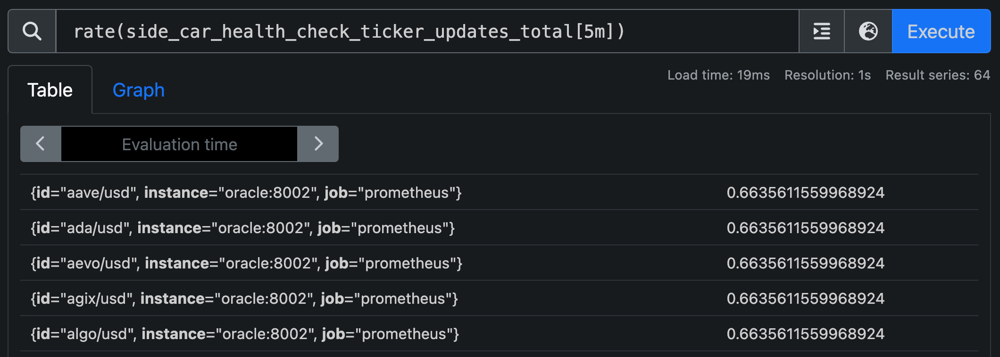

### `side_car_health_check_provider_updates_total`

This metric should be monotonically increasing for each (provider, market) pair. To verify that the rate of updates for each provider is as expected, you can run the following query in Prometheus:

```promql
rate(side_car_health_check_provider_updates_total{provider="coinbase_api", success="true"}[5m])
```

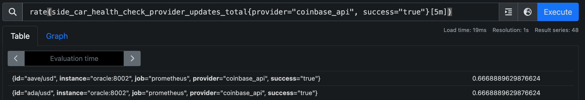

### Health Metrics Summary

In summary, the health metrics should be monitored to ensure that the side-car is updating its internal state, updating the price of each market, and fetching data from the price providers as expected. The rate of updates for each of these metrics should be inversely correlated with the `UpdateInterval` in the oracle side-car configuration. 

For example, if the `UpdateInterval` is set to 1 minute, we should expect to see an update every minute for each market and provider (rate of 1.0). If the rate of updates for the market or provider is lower than expected, this may indicate an issue with the side-car. 

## Prices Metrics

The side-car exposes various metrics related to market prices. These metrics are useful for monitoring the health of the price feeds and the aggregation process.

### Price Feed Metrics

The following price feed metrics are available to operators:

* [`side_car_provider_price`](#side_car_provider_price): The last recorded price for a given price feed.
* [`side_car_provider_last_updated_id`](#side_car_provider_last_updated_id): The last UNIX timestamp for a given price feed.

#### `side_car_provider_price`

This metric represents the last recorded price for a given price feed. The metric is indexed by the provider and market. For example, if we want to check the last recorded price of the BTC-USD market from the Coinbase API, we can run the following query in Prometheus:

```promql
side_car_provider_price{provider="coinbase_api", id="btc/usd"}
```

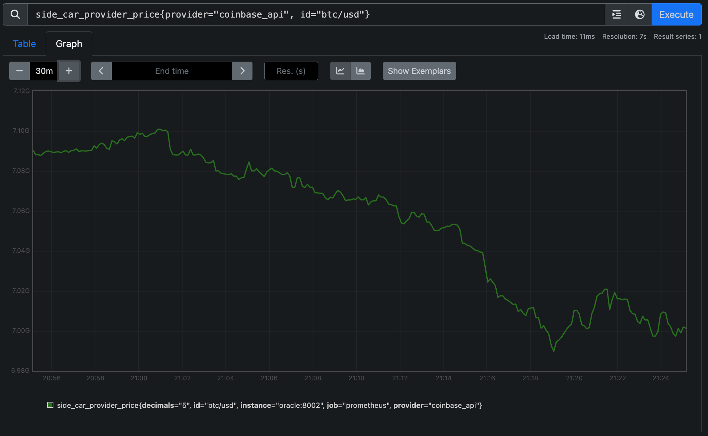

Alternatively, if we wanted to check that last recorded prices of the BTC-USD market across all price providers, we can run the following query in Prometheus:

```promql
side_car_provider_price{id="btc/usd"}
```

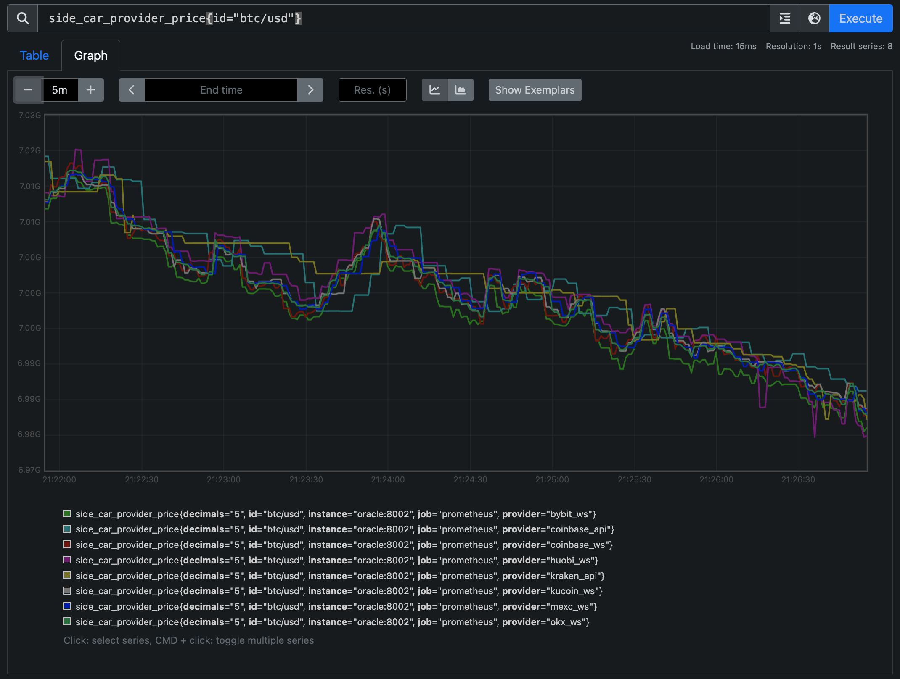

#### `side_car_provider_last_updated_id`

This metric represents the last recorded timestamp for a given price feed. The metric is indexed by the provider and market. All prices are UNIX timestamped. For example, if we want to check the last recorded timestamp of the BTC-USD market from the Coinbase API, we can run the following query in Prometheus:

```promql
side_car_provider_last_updated_id{provider="coinbase_api", id="btc/usd"}
```

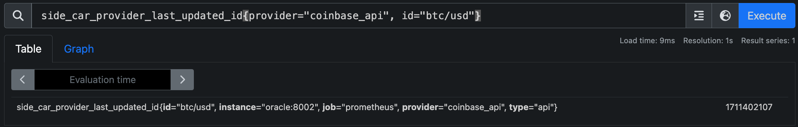

Alerts can be configured based on the age of the last recorded price. For example, if the last recorded price is older than a certain threshold, an alert can be triggered. We recommend a threshold of 5 minutes for most use cases.

### Aggregated Price Metrics

The following aggregated price metrics are available to operators:

* [`side_car_aggregated_price`](#side_car_aggregated_price): The aggregated price for a given market. This provides the final price that can be consumed by a client.

#### `side_car_aggregated_price`

This metric represents the aggregated price for a given market. Prices are aggregated across all available price feeds for a given market. The metric includes the number of decimal places for the price - which can be used to quickly identify if the price is being aggregated correctly. For example, if we want to check the aggregated price of the BTC-USD market, we can run the following query in Prometheus:

```promql
side_car_aggregated_price{id="btc/usd"}
```

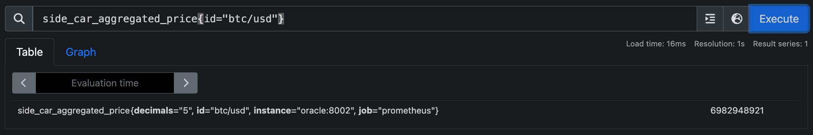

This can also be graphed for a given market to visualize the price over time.

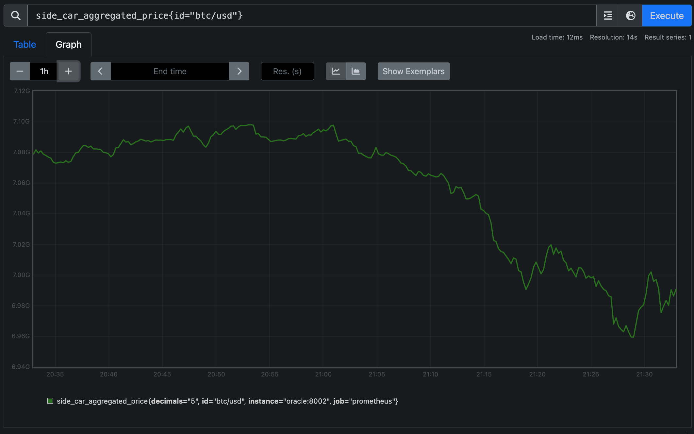

### Prices Metrics Summary

In summary, the price feed metrics should be monitored to ensure that prices look reasonable and are being updated as expected. The 
`side_car_provider_price` metrics can be used to check that the `side_car_aggregated_price` is being calculated correctly. Additionally, alerts can be set up based on the age of the last recorded price to ensure that prices are being updated in a timely manner.

## HTTP Metrics

The side-car exposes various metrics related to HTTP requests made by the side-car - including the number of requests, the response time, and the status code. These metrics can be used to monitor the health of the side-car's HTTP endpoints.

The following HTTP metrics are available to operators:

* [`side_car_api_http_status_code`](#side_car_api_http_status_code): The status codes of the HTTP response made by the side-car.
* [`side_car_api_response_latency_bucket`](#side_car_api_response_latency_bucket): The response latency of the HTTP requests made by the side-car.

### `side_car_api_http_status_code`

This metric represents the status codes of the HTTP responses made by the side-car. For example, if we want to check the status codes of the HTTP responses made by the side-car for Coinbase, we can run the following query in Prometheus:

```promql
side_car_api_http_status_code{provider="coinbase_api"}
```

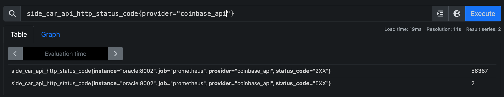

Simple queries and alerts can be configured based on the status codes to ensure that the side-car is responding as expected.

### `side_car_api_response_latency_bucket`

This metric represents the response latency of the HTTP requests made by the side-car. The metric is indexed by the provider. For example, if we want to check the response latency of the HTTP requests made by the side-car for Coinbase, we can run the following query in Prometheus:

```promql
side_car_api_response_latency_bucket{provider="coinbase_api"}
```

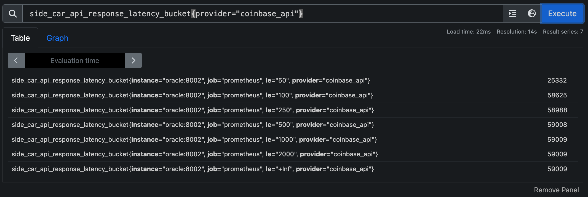

This can be used to monitor the response time of the side-car's HTTP endpoints and set up alerts based on the response time.

### HTTP Metrics Summary

In summary, the HTTP metrics should be monitored to ensure that the side-car's HTTP endpoints are responding as expected. The `side_car_api_http_status_code` metrics can be used to check the status codes of the HTTP responses, and the `side_car_api_response_latency_bucket` metrics can be used to monitor the response time of the HTTP requests.

## WebSocket Metrics

The side-car exposes various metrics related to WebSocket connections made by the side-car. These metrics can be used to monitor the health of the side-car's WebSocket connections. The following WebSocket metrics are available to operators:

* [`side_car_web_socket_connection_status`](#side_car_web_socket_connection_status): This includes various metrics related to the WebSocket connections made by the side-car.
* [`side_car_web_socket_data_handler_status`](#side_car_web_socket_data_handler_status): This includes various metrics related to whether WebSocket messages are being correctly handled by the side-car.
* [`side_car_web_socket_response_time_bucket`](#side_car_web_socket_response_time_bucket): This includes the response time of the WebSocket messages received by the side-car.

### `side_car_web_socket_connection_status`

This metric includes various metrics related to the WebSocket connections made by the side-car. Specifically, this includes the number of reads, writes, dials, and errors for each connection. For example, if we wanted to check these metrics for the Coinbase WebSocket connection, we can run the following query in Prometheus:

```promql
side_car_web_socket_connection_status{provider="coinbase_ws"}
```

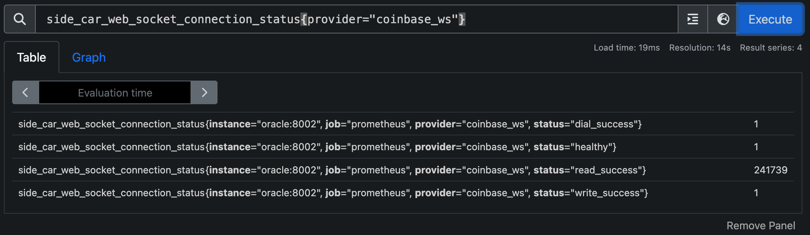

### `side_car_web_socket_data_handler_status`

This metric includes various metrics related to whether WebSocket messages are being correctly handled by the side-car. Specifically, this includes the number of messages that were correctly handled, how many heartbeats were sent, and more. For example, if we wanted to check these metrics for the Coinbase WebSocket connection, we can run the following query in Prometheus:

```promql
side_car_web_socket_data_handler_status{provider="coinbase_ws}
```

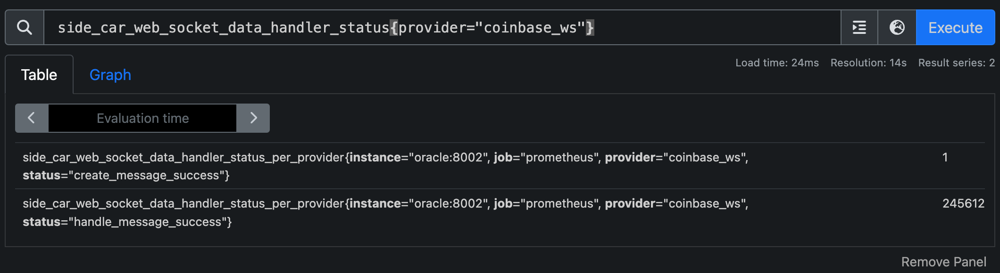

The most important statuses to monitor here are `handle_message_success` and `heart_beat_success`. These metrics should be close to the total number of messages and heartbeats sent by the WebSocket connection.

### `side_car_web_socket_response_time_bucket`

This metric includes the response time of the WebSocket messages received by the side-car. Specifically, this includes the time it took to receive a new message and process it. For example, if we wanted to check the response time for the Coinbase WebSocket connection, we can run the following query in Prometheus:

```promql
side_car_web_socket_response_time_bucket{provider="coinbase_ws"}
```

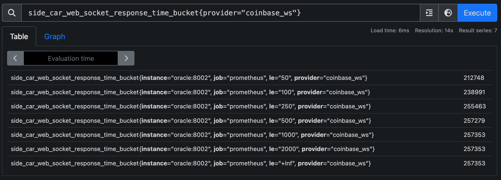

This can be used to monitor the response time of the WebSocket messages received by the side-car and set up alerts based on the response time. We recommend alerts be set up if the response time exceeds a threshold of 5 minutes.

### WebSocket Metrics Summary

In summary, the WebSocket metrics should be monitored to ensure that the side-car's WebSocket connections are functioning as expected. The `side_car_web_socket_connection_status` metrics can be used to check the number of read, write, and dial errors, the `side_car_web_socket_data_handler_status` metrics can be used to check that messages are being correctly handled, and the `side_car_web_socket_response_time` metrics can be used to monitor the response time of the WebSocket messages.

# Conclusion

This document has provided an overview of the various metrics that are available in the side-car. These metrics can be used to monitor the health of the side-car and the services it is proxying. By monitoring these metrics, operators can ensure that the side-car is functioning as expected and take action if any issues arise.


