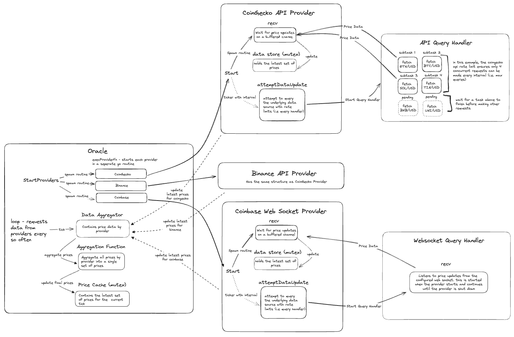

# Base Provider

## Overview

The Base Provider is a special provider that is used to provide the base functionality for all other providers. It is not intended to be used directly, but instead serves as a base for other providers to extend.

The base provider is responsible for the following:

* Implementing the oracle `Provider` interface directly just by inheriting the base provider.
* Having the provider data available in constant time when requested.

Each base provider implementation will be run in a separate goroutine by the main oracle process. This allows the provider to fetch data from the underlying data source asynchronusly. The base provider will then store the data in a thread safe map. The main oracle service utilizing this provider can determine if the data is stale or not based on result timestamp associated with each data point.

The base provider constructs a response channel that it is always listening to and making updates as needed. Every interval, the base provider will fetch the data from the underlying data source and send the response to the response channel, respecting the number of concurrent requests to the rate limit parameters of the underlying source (if it has any).




## API (HTTP) Based Providers

In order to implement API based providers, you must implement the [`APIDataHandler`](./handlers/api_data_handler.go) interface and the [`RequestHandler`](./handlers/request_handler.go) interfaces. The `APIDataHandler` is responsible for creating the URL to be sent to the HTTP client and parsing the response from the HTTP response. The `RequestHandler` is responsible for making the HTTP request and returning the response.

Once these two interfaces are implemented, you can then instantiate an `APIQueryHandler` and pass it to the base provider. The `APIQueryHandler` is abstracts away the logic for making the HTTP request and parsing the response. The base provider will then take care of the rest. The responses from the `APIQueryHandler` are sent to the base provider via a buffered channel. The base provider will then store the data in a thread safe map.

### APIDataHandler

The `APIDataHandler` interface is primarily responsible for constructing the URL that will fetch the desired data and parsing the response. The interface is purposefully built with generics in mind. This allows the provider to fetch data of any type from the underlying data source.

```golang
// APIDataHandler defines an interface that must be implemented by all providers that
// want to fetch data from an API using HTTP requests. This interface is meant to be
// paired with the APIQueryHandler. The APIQueryHandler will use the APIDataHandler
// to create the URL to be sent to the HTTP client and to parse the response from the
// API.
type APIDataHandler[K comparable, V any] interface {
	CreateURL(ids []K) (string, error)
	ParseResponse(ids []K, response *http.Response) GetResponse[K, V]
	Atomic() bool
	Name() string
}
```

#### Determining K and V

> **Currently the oracle only supports `*big.Int` as the `V` type and `oracletypes.CurrencyPair` as the `K` type.** This will change in the future once generics are supported on the chain side.

First developers must determine the type of data that they want to fetch from the underlying data source. This can be any type that is supported by the oracle. For example, the simplest example is price data for a given currency pair (base / quote). The `K` type would be the currency pair and the `V` type would be the price data.

```golang
APIDataHandler[oracletypes.CurrencyPair, *big.Int]
```

#### CreateURL

The `CreateURL` function is responsible for creating the URL that will be sent to the HTTP client. The function should utilize the IDs passed in as references to the data that needs to be fetched. For example, if the data source requires a currency pair to be passed in, the `CreateURL` function should use the currency pair to construct the URL.

#### ParseResponse

The `ParseResponse` function is responsible for parsing the response from the API. The response should be parsed into a map of IDs to results. If any IDs are not resolved, they should be returned in the unresolved map. The timestamp associated with the result should reflect either the time the data was fetched or the time the API last updated the data.

#### Atomic

The `Atomic` function is used to determine whether the handler can make a single request for all of the IDs or multiple requests for each ID. If true, the handler will make a single request for all of the IDs. If false, the handler will make a request for each ID.

#### Name

The `Name` function is used to get the name of the handler. 

### RequestHandler

The request handler is responsible for making the HTTP request and returning the response.

```golang
// RequestHandler is an interface that encapsulates sending a request to a data provider.
type RequestHandler interface {
	Do(ctx context.Context, url string) (*http.Response, error)
}
```

#### Do

The `Do` function is responsible for making the HTTP request and returning the response.

This interface is particularly useful if a custom HTTP client is needed. For example, if the data provider requires a custom header to be sent with the request, the `RequestHandler` can be used to implement this logic.

## API (HTTP) Considerations

### Number of Go Routines

#### Atomic Handlers

For atomic API handlers, the maximal number of concurrent go routines that can be run at the same time is 4.

* 1. The main oracle process to start the provider
* 2. The provider to call the query handler with the context and timeout.
* 3. The provider to make the HTTP request.
* 4. The provider receive channel.


#### Non-Atomic Handlers

For non-atomic API handlers, the maximal number of concurrent go routines that be run is a function of the maximum queries configured for the provider + 3.

* 1. The main oracle process to start the provider.
* 2. The provider to call the query handler with the context and timeout.
* 3. The provider to make the HTTP request (max queries).
* 4. The provider receive channel.


### Maximal number of data points that can be fetched (i.e. prices)

#### Atomic Handlers

For atomic API handlers, the maximal number of data points that can be fetched is dependent on the availability of the data source. For example, if an exchange can only support N number of currency pairs in a single request, then the maximal number of data points that can be fetched is N.

#### Non-Atomic Handlers

For non-atomic API handlers, the maximal number of data points that be fetched is a function of the oracle interval, provider interval, provider timeout, and max queries.

The maximal number of data points that can be fetched is:

```golang
maxDataPoints := (oracleInterval / (providerInterval / providerTimeout)) * maxQueries
```

For example, if the oracle interval is 4 seconds, provider interval is 1 second, provider timeout is 250 milliseconds, and max queries is 4, then the maximal number of data points that can be fetched is 64.

## Future Work

* Add support for web socket data sources.
